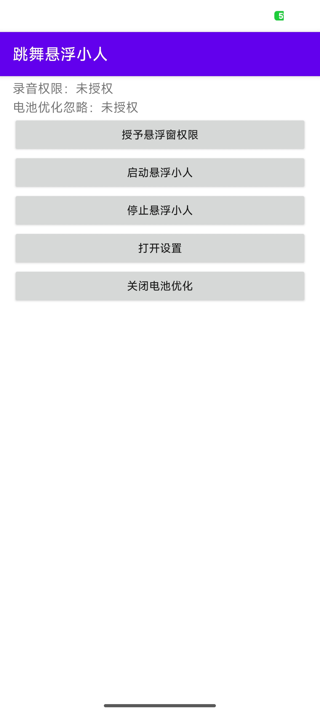
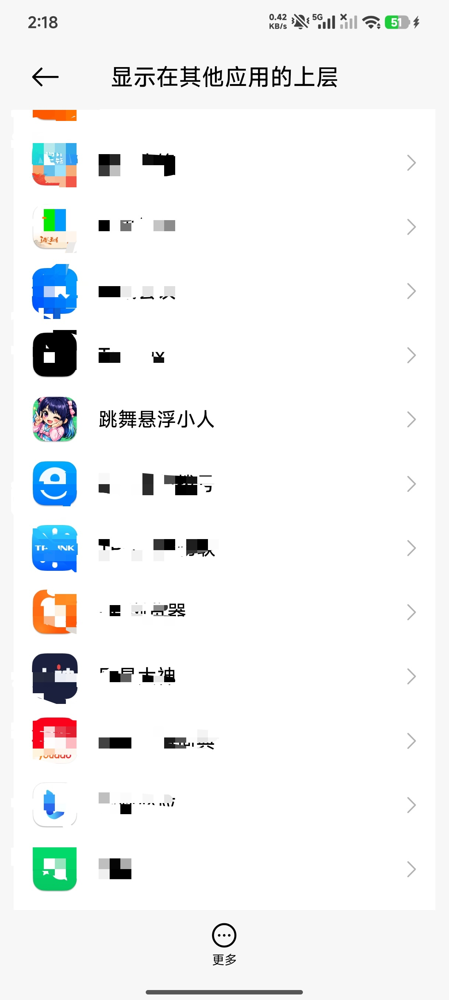
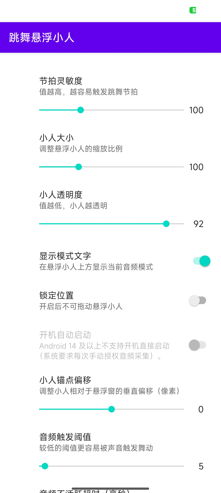
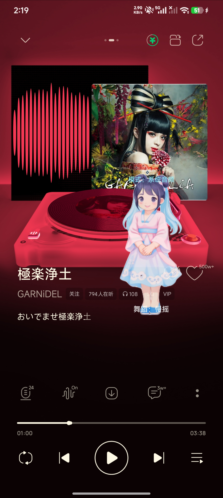

# Dancing Overlay（Android）

[English](./README_en.md) | [中文](./README.md)

Dancing Overlay 是一个 Android 悬浮舞者应用：它可以在其他应用之上显示可拖拽的小人/头像，捕获系统媒体播放音频，根据音量和节拍切换动作，并支持把用户上传的单张人物图片通过本地 AI 生成一组唱跳动作帧。

## 当前能力

- **悬浮舞者**：通过 `TYPE_APPLICATION_OVERLAY` 显示在其他应用上方，可拖拽、可锁定位置。
- **前台服务保活**：`OverlayService` 以通知前台服务运行，支持隐藏/显示/停止悬浮窗。
- **播放音频捕获**：Android 10+ 使用 MediaProjection + AudioPlaybackCapture 捕获媒体/游戏音频。
- **节拍驱动动画**：`BeatDetector` 使用 FFT / spectral-flux 风格 onset 检测，将音频事件映射到小人动作。
- **OpenGL ES 渲染**：`OpenGLESView` / `OpenGLESRenderer` 对头像纹理做网格形变和节拍脉冲效果。
- **双图片集**：设置页可管理图片集 1 / 图片集 2，并一键切换当前悬浮头像样式。
- **本地 AI 生成动作帧**：上传单张图片后，可选择 10–100 帧，由 MoveNet 姿态检测 + `pose_driven_generator.tflite` 生成连贯唱跳帧。
- **离线推理优先**：模型放在 `app/src/main/assets/models/`，APP 端不依赖外部服务器。
- **电池优化提示**：提供跳转系统白名单/忽略电池优化页面的入口。

## 运行环境

- Android Studio / Gradle Wrapper
- JDK 17
- Android Gradle Plugin 项目配置：`compileSdk 36`、`targetSdk 36`、`minSdk 24`
- 悬浮舞者音频捕获：Android 10（API 29）及以上效果最佳
- 包名 / Application ID：`com.example.myapplication`

## 快速运行

```bash
./gradlew :app:assembleDebug
```

也可以直接使用 Android Studio 打开项目并运行 `app` 模块。

首次使用流程：

1. 安装并打开应用。
2. 点击 **Grant Overlay Permission**，授予“在其他应用上层显示”。
3. 点击 **Start Floating Dancer**。
4. 按提示授予录音权限、通知权限（Android 13+）和系统捕获权限。
5. 在支持播放捕获的音乐/视频/游戏应用中播放声音，悬浮小人会随音频活动和节拍运动。
6. 进入 **Settings** 调整灵敏度、大小、透明度、位置锁定、开机自启等选项。

## 图片集与 AI 生成

设置页提供两个自定义图片集入口：

- **管理图片集 1**：默认悬浮头像来源，保存到应用私有目录 `files/custom_avatars/set1/`。
- **管理图片集 2**：备用头像来源，保存到应用私有目录 `files/custom_avatars/set2/`。

图片集页面支持：

- 单张上传、批量上传、预览、删除、清空。
- 选择生成帧数，范围 10–100，默认 30。
- 点击 **AI 生成唱跳动作**，从相册选择单张人物图片并生成 `dancer_single1.png`、`dancer_single2.png` ... 动作序列。
- 每次 AI 生成会清理该图片集中旧的 `dancer_single*.png` 生成帧，避免新旧动作混用。

AI 推理链路：

```text
上传图片
  -> ImageCompressor 压缩/旋转修正
  -> PoseDetector 检测 17 个关键点（优先 MoveNet，失败则简化姿态）
  -> AvatarStyleFrameRenderer / TruePoseDrivenModel 生成目标姿态帧
  -> DanceFrameGenerator 保存到当前图片集
  -> DancerOverlayView 加载并播放帧序列
```

## 模型资源

当前项目使用的模型路径：

- `app/src/main/assets/models/movenet_thunder.tflite`：MoveNet 单人姿态检测模型。
- `app/src/main/assets/models/pose_driven_generator.tflite`：本地姿态驱动图像生成模型。

`PoseDetector` 会优先加载 `movenet_thunder.tflite`；如果加载失败，会退回基于图片比例的简化姿态估计。

`TruePoseDrivenModel` 只接受兼容的 TFLite 图像生成模型：

- 输入为 NHWC 图像张量。
- 至少包含 reference/source image 与 target pose/condition/skeleton 两类输入。
- 可选 source pose 输入。
- 输出为 RGB/RGBA 图像张量。

更多模型训练、蒸馏和检查说明见：

- `docs/pose_driven_generator_contract.md`
- `docs/pose_driven_model_options.md`
- `docs/building_a_pose_driven_model.md`
- `tools/pose_model_factory/README.md`

可用脚本检查模型是否满足 APP 接入契约：

```bash
python3 tools/pose_driven_model/inspect_pose_driven_tflite.py \
  app/src/main/assets/models/pose_driven_generator.tflite
```

## 项目结构

```text
app/src/main/java/com/example/myapplication/
├── MainActivity.kt                    # 权限流程与主界面
├── OverlayService.kt                  # 前台服务、悬浮窗生命周期、音频回调
├── DancerOverlayView.kt               # 悬浮窗 UI、拖拽、帧播放
├── AudioCaptureManager.kt             # MediaProjection 播放捕获
├── BeatDetector.kt / FftAnalyzer.kt   # FFT 节拍检测
├── OpenGLESView.kt / OpenGLESRenderer.kt
│                                      # OpenGL ES 头像渲染与网格形变
├── AvatarLoader.kt                    # 图片集加载、缓存、预处理
├── AvatarImageManager.kt              # 用户图片集文件管理
├── AvatarUploadActivity.kt            # 图片上传、批量管理、AI 生成入口
├── AIModelManager.kt                  # 姿态检测与动作帧生成总控
├── PoseDetector.kt                    # MoveNet / 简化姿态检测
├── TruePoseDrivenModel.kt             # 真实 TFLite 姿态驱动生成模型适配器
├── DanceFrameGenerator.kt             # 生成帧保存到图片集
├── AvatarSpriteChoreographyEngine.kt  # 精灵帧编排
├── RhythmStyleEngine.kt               # 节奏风格计算
├── SettingsActivity.kt                # 设置页
├── OverlaySettings.kt                 # 设置持久化
└── BootCompletedReceiver.kt           # 可选开机自启
```

其他目录：

- `app/src/main/assets/models/`：TFLite 模型。
- `app/src/main/assets/lottie/`：Lottie 资源。
- `app/src/main/res/xml/root_preferences.xml`：设置页配置。
- `docs/`：姿态驱动模型说明。
- `tools/pose_model_factory/`：教师模型蒸馏与学生模型导出工具。
- `tools/pose_driven_model/`：TFLite 模型检查工具。
- `effect_picture/`：项目效果图。

## 权限说明

应用声明并使用以下主要权限：

- `SYSTEM_ALERT_WINDOW`：显示悬浮窗。
- `RECORD_AUDIO`：配合播放捕获读取音频数据。
- `FOREGROUND_SERVICE` / `FOREGROUND_SERVICE_MEDIA_PROJECTION`：在前台服务中持续捕获播放音频。
- `POST_NOTIFICATIONS`：Android 13+ 前台服务通知。
- `RECEIVE_BOOT_COMPLETED`：可选开机自启。

## 注意事项

- Android 播放捕获受系统版本、应用策略和 DRM 限制；部分播放器或内容无法捕获音频。
- Android 14+ 对 MediaProjection 前台服务更严格，必须通过用户授权的捕获数据启动服务。
- AI 生成帧会消耗较多内存和时间，请尽量使用清晰、主体完整、大小适中的人物图片。
- 上传图片单文件大小限制为 5 MB，超出会被拒绝生成。
- Release 构建当前使用 debug keystore 兜底签名，正式发布前请替换为生产签名配置。

## 效果图








