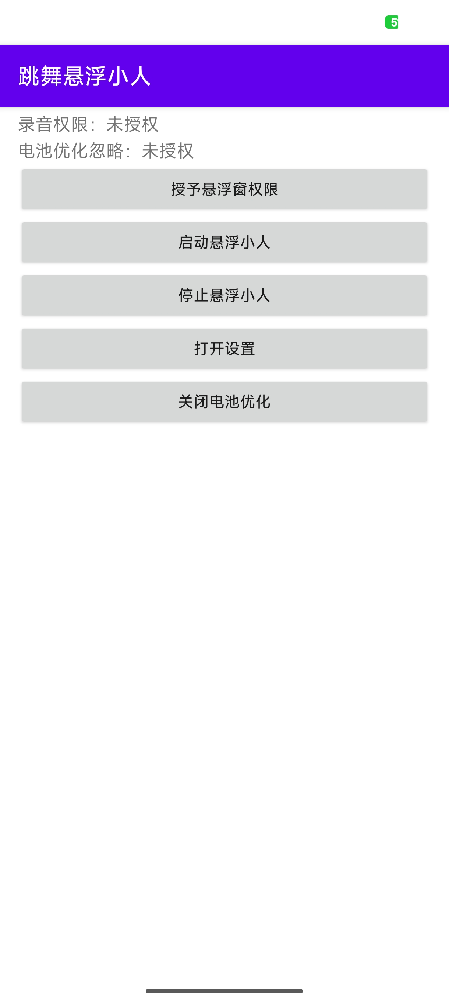
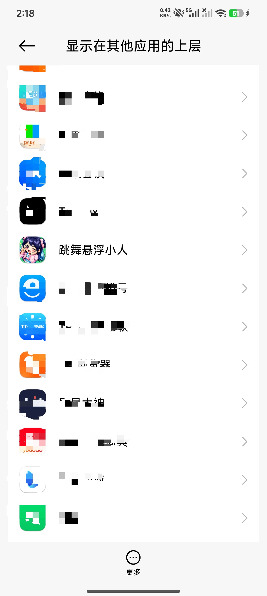
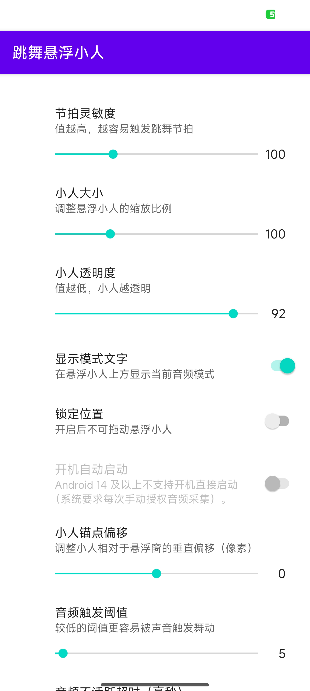
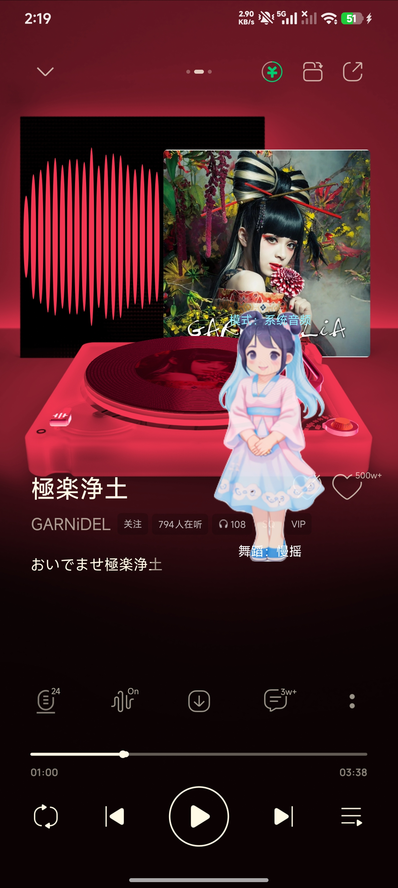

# Dancing Overlay (Android)

An Android app that displays a floating dancing avatar on top of other apps and drives animations based on music beats.

## Features

- A draggable floating overlay (TYPE_APPLICATION_OVERLAY).
- A foreground service keeps the overlay alive when the app is in the background.
- An OpenGL ES rendering pipeline prepared for the avatar (for beat-driven keyframe/transitions), with a built-in PNG fallback sequence (example names like `dancer_single1..` ~ `dancer_single9..`).
- Beat detection using a spectral-flux style onset method on FFT frequency streams.
- Audio capture modes:
  - Playback capture only (Android 10+, requires MediaProjection permission).
- Settings page:
  - Beat sensitivity
  - Avatar size
  - Avatar opacity
  - Position lock
  - Auto-start on boot
- Battery optimization guidance (can direct the user to whitelist settings).

## Project structure

- `app/src/main/java/com/example/myapplication/MainActivity.kt`: Permission flow and controls.
- `app/src/main/java/com/example/myapplication/OverlayService.kt`: Foreground service and overlay lifecycle management.
- `app/src/main/java/com/example/myapplication/AudioCaptureManager.kt`: Audio capture loop.
- `app/src/main/java/com/example/myapplication/BeatDetector.kt`: FFT-based onset/beat event generator.
- `app/src/main/java/com/example/myapplication/FftAnalyzer.kt`: In-app FFT implementation.
- `app/src/main/java/com/example/myapplication/DancerOverlayView.kt`: Floating overlay container and text/status layout.
- `app/src/main/java/com/example/myapplication/OpenGLESAvatarView.kt`: Avatar host view supporting OpenGL ES with a PNG fallback.
- `app/src/main/java/com/example/myapplication/OpenGLESMotionController.kt`: Maps beats/audio to OpenGL ES parameters/motion.
- `app/src/main/java/com/example/myapplication/DancingAvatarView.kt`: Built-in 2D dancing character rendering and beat-response logic (Canvas/fallback implementation).
- `app/src/main/java/com/example/myapplication/SettingsActivity.kt`: App settings UI.
- `app/src/main/java/com/example/myapplication/OverlaySettings.kt`: Settings model and persistence.
- `app/src/main/java/com/example/myapplication/BootCompletedReceiver.kt`: Optional boot-start receiver.
- `app/src/main/java/com/example/myapplication/PowerOptimizationHelper.kt`: Battery optimization helper.
- `app/src/test/java/com/example/myapplication/BeatDetectorTest.kt`: Simple unit tests for beat detection.

## How to run

1. Optional: If you plan to use the runtime OpenGL ES renderer, place models or texture resources under `app/src/main/assets/`.
2. Recommended: Put the PNG fallback dancing frames into `app/src/main/res/drawable-nodpi/` named `dancer_single1...png` through `dancer_single9...png` (or whatever range you have) so the app prefers packaged drawable resources at runtime.

   - If your frames are currently in `app/src/main/assets/` (older approach), the app will fall back to loading from assets when drawable resources are missing. However, packaging them in `res/drawable(-nodpi)/` is recommended for easier packaging, density handling, and faster resource lookup.

   Example (copy files from assets to drawable-nodpi):

   ```bash
   mkdir -p app/src/main/res/drawable-nodpi
   cp app/src/main/assets/avatar/dancer_single{1..18}.png app/src/main/res/drawable-nodpi/  # adjust range if different
   ./gradlew :app:processDebugResources
   ```
3. Build/install from Android Studio or using the Gradle wrapper.
4. Open the app and grant:
   - Overlay (draw over other apps) permission
   - Recording / audio capture permission
5. Tap "Start Floating Dancer" to launch the overlay.
6. Agree to the system capture prompt to allow playback capture.
7. Play music in a supported player; the overlay will drive OpenGL ES style keyframes/transitions based on beats and audio. PNG fallbacks are used until the runtime OpenGL renderer is ready.
8. If notification access is granted, the overlay can also display the current song title/artist (used for dance-style parsing).
9. Open Settings to adjust sensitivity, size, opacity, position lock, and optional auto-start on boot.

## Notes and limitations

- Android imposes policies and permission restrictions on playback capture; some apps or streams may not be capturable.
- Playback capture is available on Android 10 and later.
- Availability of playback capture may also be restricted by the source app's policy/DRM.

## Payment Receipt Code

If you'd like to support the project, scan the payment QR code below:

## Screenshots

The following are demonstration screenshots (in order):










